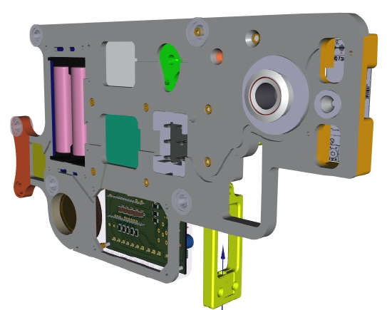

# arduino-smart-lock
# 🚪 Умный дверной замок на Arduino Nano



**Автономная система управления дверным замком с психоакустической индикацией и интеллектуальным контролем доступа**

Проект разработан с упором на надежность, использование свободного ПО (Linux, Arduino IDE) и комфорт пользователей.

---

## ✨ Особенности проекта

### 🔇 Психоакустический "тихий режим"
Вместо стандартного пронзительного писка используется алгоритм **сверхкоротких импульсов** (микросекундные задержки), превращающий звук активного зуммера в мягкий, интеллигентный "щелчок" (в стиле счетчика Гейгера из Half-Life).

### 🎵 Динамическая мелодия удержания
При удержании двери в открытом состоянии система подает сигналы с **ускоряющимся ритмом**. Интервалы между сигналами рассчитываются по формуле **геометрической прогрессии** (закон Вебера-Фехнера), что интуитивно воспринимается человеком как нарастающее "предупреждение о скором закрытии".

###  Двухуровневая система тревоги
Если замок двери остается разблокированным слишком долго:
1. Включается **звуковая сирена** и мигание светодиода
2. Через заданное время **звук автоматически отключается** (чтобы не беспокоить)
3. **Визуальная LED-индикация** продолжает работать до момента блокирования замка двери

### ⚙️ Настраиваемая громкость
3 уровня громкости "щелчков", выбираемые через сервисную кнопку и сохраняемые в EEPROM.

### 🛡️ Аппаратная надежность
- Использование **watchdog-таймера (WDT)**
- Защита от дребезга контактов (debounce)
- Корректное управление питанием сервопривода (отключение после движения)

---

## 🔧 Используемые компоненты

| Компонент | Назначение |
|-----------|------------|
| **Arduino Nano** (ATmega328P) | Микроконтроллер |
| **Сервопривод** (SG90/MG995) | Механическое открытие/закрытие |
| **Датчик Холла** | Определение положения ригеля |
| **Сканер отпечатков пальцев** (К202+R503) | Контроль доступа |
| **Wi-Fi модуль** | Управление замком из УД с Алисой |
| **Активный зуммер** | Звуковая индикация |
| **LED индикаторы** | Визуальная индикация состояния |
| **Кнопки/сканеры** | Триггеры открытия (активный низкий уровень) |

---

## 📐 Схема подключения

| Компонент | Пин Arduino | Примечание |
|-----------|-------------|------------|
| Сервопривод | D10 | PWM |
| Зуммер | D9 | PWM (режим быстрых импульсов) |
| Датчик Холла | D6 | INPUT_PULLUP, активный низкий |
| Сервисная кнопка | D4 | INPUT_PULLUP, настройка громкости |
| Триггеры открытия | D2, D3, D5 | INPUT_PULLUP |
| LED индикации | D8, D11, D13 | D11 - PWM (режим "дыхание" подсветки) |

---

## 🚀 Установка и настройка

### 1. Прошивка
Загрузите код `door_lock.ino` с помощью **Arduino IDE** или **PlatformIO**.

### 2. Настройка громкости
- **Удерживайте** сервисную кнопку (D4) более **1.5 секунды** → вход в режим настройки
- **Коротко нажимайте** кнопку для переключения между 3 уровнями громкости
- **Удерживайте** кнопку 1.5 секунды → сохранение в EEPROM и выход

### 3. Основные параметры
В начале файла `door_lock.ino` можно изменить:

```cpp
const unsigned long HOLD_TIME = 10000;        // Время удержания (мс)
const byte HOLD_TICK_COUNT = 30;              // Количество тиков
const unsigned long ALARM_DELAY = 15000;      // Задержка до тревоги (мс)
const unsigned long ALARM_SOUND_DURATION = 15000; // Длительность звука тревоги (мс)

### 🤝 Вклад в проект
Проект создан с любовью к свободному ПО и точным наукам. Если у вас есть идеи по улучшению кода, оптимизации или новые идеи для мелодий — Pull Request'ы приветствуются!

### 📜 Лицензия
Этот проект распространяется под лицензией MIT License — используйте freely в любых целях.

👨‍ Автор
Vadimyar — физик, энтузиаст Linux и свободного ПО, разработчик образовательных проектов на Arduino/ESP.
"Замок должен быть не только надежным, но и интеллигентным"

<div align="center">

Сделано с ❤️ на Arduino и Linux
⬆️ В начало
</div>
